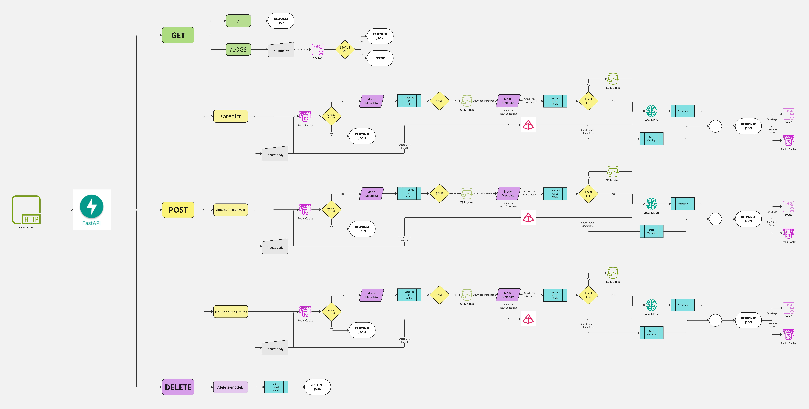

# Model Serving System Design

This repository implements a model-serving system, providing endpoints to deploy and use machine learning models for predictions. The system incorporates several modern tools and technologies for performance monitoring, storage, and caching.

## Project Features

### Technologies Used
- Python 3.13: Backend development with FastAPI for REST API creation.
- FastAPI: API framework with automatic interactive documentation.
- Prometheus: For metrics collection and monitoring.
- Grafana: Dashboard visualization for Prometheus metrics.
- Redis: Used for caching predictions.
- SQLite: Lightweight database for logging requests and predictions.
- AWS S3: For storing and retrieving model files and metadata.
- Pydantic: For request validation and dynamic schema generation.

### Folder Structure
```
src/
├── aws/
│   ├── __init__.py
│   └── s3_Manager.py           # Utilities for AWS S3 interactions
├── DB/
│   └── sqlite.db               # SQLite database for logs
├── middleware/
│   ├── __init__.py
│   └── Metrics.py              # Custom middleware for metrics monitoring
├── models/
│   ├── __init__.py
│   ├── Model_Training.ipynb    # Jupyter Notebook for model training
│   ├── Model_Utils.py          # Utilities for handling models
│   └── Models/                 # Directory for model files
├── pydantic/
│   ├── __init__.py
│   └── Models.py               # Dynamic schema generation for model inputs
├── redis/
│   ├── __init__.py
│   └── cache.py                # Cache management for faster responses
├── sqlite_manager/
│   ├── __init__.py
│   └── logs.py                 # Logging system for predictions
├── utils/
│   ├── __init__.py
│   ├── config.py               # Configuration helper utilities
│   └── Plotting_Utils.py       # Plotting and visualization utilities
main.py                         # Core FastAPI application defining API endpoints
docker-compose.yml              # Configuration for running the project with Docker Dockerfile                      # Dockerfile to containerize the application
prometheus.yml                  # Prometheus configuration file
requirements.txt                # Python dependencies
README.md                       # Project documentation
LICENSE                         # License for the project
```

## API Endpoints
### Root Endpoint
	•	GET /
	•	Returns a health check response with a status.

### Predict Using Active Model
    POST /predict
	Input:
	•	input_data: JSON object containing model inputs.
	•	api_key: Authentication token.
	Output:
	•	Returns predictions using the active model based on input data.
	•	Caches response in Redis.

### Predict Using Specific Model Type
	POST /predict/{model_type}
	Input:
	•	model_type: Specify the type of model to use.
	•	input_data: JSON object containing model inputs.
	•	api_key: Authentication token.
	Output:
	•	Returns predictions and logs them in SQLite.
	•	Caches the result for faster subsequent access.

### Predict Using Specific Model and Version
	POST /predict/{model_type}/{version}
	Input:
	•	model_type: The model type (e.g., Logistic Regression, XGBoost).
	•	version: Version of the model to use.
	•	input_data: JSON object containing model inputs.
	•	api_key: Authentication token.
	Output:
	•	Returns predictions using the specified model version.

### Logs Retrieval
    GET /logs?n_limit={n}
	Input:
	•	n_limit: Number of logs to retrieve.
	•	api_key: Authentication token.
	Output:
	•	Returns the most recent n_limit logs.

### Delete All Models
	DELETE /delete-models
	Input:
    •    api_key for authentication.
	Output:
	•	Deletes all model files except metadata.

## Architecture


## How to Run the Project
### Prerequisites
- Docker and Docker Compose installed.
- AWS credentials set up for accessing S3.

### Commands
1.	Clone the Repository:
```bash
git clone https://github.com/your-repo/model-serving-system.git
cd model-serving-system
```

2.	Build and Run Docker Compose:
```bash
docker-compose up --build
```

3.	Access the API:
```
- API Base URL: http://localhost:8000
- Documentation:
    - Swagger: http://localhost:8000/docs
    - ReDoc: http://localhost:8000/redoc
```

4.	Monitoring Tools:
```
- Prometheus: http://localhost:9090
- Grafana: http://localhost:3000 (Default Credentials: admin:admin)
```

## License
This project is licensed under the MIT License. See the LICENSE file for details.